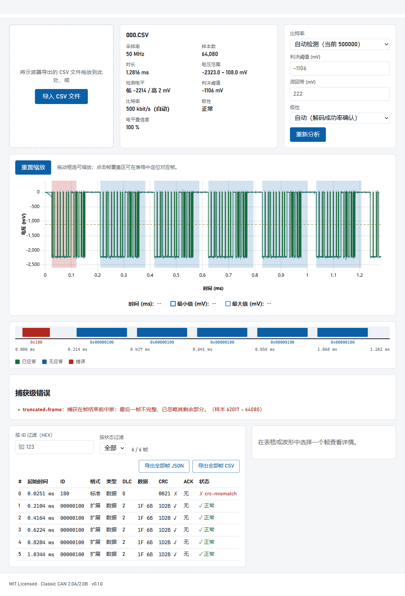

# CAN Waveform Analyzer

> 浏览器端 CAN 波形分析器：导入示波器 CSV，自动检测比特率并解码 Classic CAN 2.0A/2.0B 帧。


<!-- TODO: 截图占位。发布前替换为实际界面截图。 -->

**在线体验**：`https://<owner>.github.io/<repo>/`
<!-- TODO: 仓库发布到 GitHub Pages 后替换为真实 URL。 -->

## 隐私声明

**捕获数据永远不会离开你的浏览器。** 文件解析、量化、比特率检测和 CAN 解码全部在本地 Web Worker 中完成；本项目没有任何后端、上传、账号或云存储。

## 支持的 CSV 输入格式

第一行为元数据头，之后每行一个电压样本：

```text
CH(mV)  probe:X1,sampling rate : 50000000
6
-2
-2220
...
```

具体文法：

- 头部：`<通道>(<单位>)`，可选 `probe:<衰减>`，必需 `sampling rate : <正数>`（大小写不敏感、容忍空格差异）。
- 样本：每行一个十进制或科学计数法数值（如 `-2222.75`、`1e-3`）。拒绝十六进制（`0x10`）、`Infinity`、下划线分隔等非严格格式。
- 容忍 UTF-8 BOM、CRLF/LF 混合换行和空行。
- 超出 Float32 表示范围的值（如 `1e100`）会报错并给出行号。

## 功能

- 波形总览（降采样 min/max 包络）+ 深度缩放时的**位级精确方波**重建。
- 自动两电平聚类阈值/滞回估计，支持手动覆盖（阈值、滞回带、极性）。
- 自动比特率检测（10 kbit/s – 1 Mbit/s 常用速率 + 自定义速率），双极性候选按空闲证据与解码成功率共同确认。
- Classic CAN 2.0A/2.0B 数据帧/远程帧解码：ID、IDE、RTR、DLC、载荷、CRC-15 校验、ACK、时间戳、字段区间。
- 位填充校验、CRC 校验、界定符/EOF 校验；坏帧局部化并从下一个空闲边界恢复。
- 帧过滤（ID/状态）、表格 ↔ 波形联动导航、JSON/CSV 导出（RFC 4180，防公式注入）。
- 大文件分析在 Web Worker 中执行，可取消（terminate 语义，真正中断计算）。

## 限制（v1）

- 仅支持 Classic CAN，**不支持** CAN FD、CAN XL、DBC 导入、USB/串口实时采集。
- 噪声大、空闲段过短或采样率过低（每位 < 4 个样本）的捕获可能需要手动指定比特率/极性/阈值。
- 无法保证解码没有可观测“空闲→SOF”边沿的捕获。

## 本地开发

```powershell
npm ci          # 安装依赖
npm run dev     # 开发服务器
npm test -- --run   # 运行全部测试
npm run typecheck   # TypeScript 检查
npm run build   # 生产构建（输出 dist/）
npm run preview # 预览生产构建
```

## 架构


采样点索引是内部唯一时间坐标，显示时间按 `timeSeconds = sampleIndex / sampleRateHz` 换算。

- `src/core/`：框架无关的确定性 TypeScript 模块（解析、量化、检测、CRC、去位填充、解码、导出），全部有单元测试。
- `src/workers/`：分析管线（`analysisPipeline.ts`）与 Worker 消息编排（`analyzer.worker.ts`），主线程只接收降采样概览、精确变化点和解码结果。
- `src/components/` + `src/app/App.tsx`：React UI，empty → loading → analyzed | error 四态互斥。

## 使用示例（000.CSV）

以 50 MHz 采样、约 64,080 个样本的 `000.CSV` 为例（该文件不随仓库分发）：

1. 打开应用，将 `000.CSV` 拖入导入区。
2. 应用解析出 50 MHz 采样率、约 1.2816 ms 时长，自动聚类出约 0 mV 与约 -2.22 V 两个电平。
3. 自动比特率检测应将 **500 kbit/s** 排为第一。
4. 波形叠加帧覆盖色块；点击表格行可缩放到对应帧，深度缩放可见每个位。
5. 通过“导出全部帧 JSON/CSV”保存解码结果。

若自动检测置信度不足（短捕获/强噪声），按界面提示手动确认比特率与极性。

## GitHub Pages 部署

仓库使用 `.github/workflows/deploy-pages.yml` 自动部署：推送到 `main` 后运行测试、类型检查与构建，并将 `dist/` 发布到 Pages。首次启用需在仓库 **Settings → Pages** 中将 Source 设为 **GitHub Actions**。

## 许可证

[MIT](LICENSE)。版权所有者见 LICENSE 文件。
